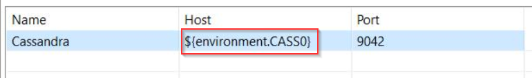

# Axway - API Gateway Helm Chart

As with many Kubernetes solutions, we use helm to manage the deployment of the API Gateway infrastructure. Helm is a very powerful tool that uses a management structure, that it refers to as charts, to define the resources you want to deploy to your Kubernetes cluster. These resources can then be parameterized to enable easy configuration and customization from a single location. Charts can also be divided into sub-charts if some resources may only need to be deployed under certain criteria. While helm notably simplifies the deployment and management of artifacts in a Kubernetes cluster, some familiarity with Kubernetes, it's basic tools and the resources it uses would be desirable to correctly understand what a helm chart does and to be able to troubleshoot in the event of any issues.

The Helm charts provided here contain all the Kubernetes manifest files required to run the API Gateway in Kubernetes. This includes deployment of Admin Node Manager, API Manager UI, and API Gateway Traffic containers as well as configuring an external MySQL database should it be present. Cassandra database is deployed outside of a Kubernetes cluster. These charts should be able to deploy on most clusters regardless of where it is running. These charts include only Ingress Controllers that allow external connection to the cluster. The Ingress controller is based on Nginx. Port-forwarding can be configured to validate the services and cluster without these external connections being configured.

## Prerequisites

Make sure you meet the following prerequisites before deploying these Helm charts:

- As stated some familiarity with Kubernetes tools is required as well as knowledge of the gateway setup such as FED configuration. 
- Kubectl installed. **This Helm chart was tested with v1.17.2.**
- Kubernetes cluster built - we use kops to build our clusters in AWS, but this chart should work on any cluster, regardless of how it should be built.
- FED configured - FED should be configured using Policy Studio. Some of the settings, such as Cassandra and MySQL need to match the variables provided to the helm charts. More info to follow.
- Images built using EMT Scripts and pushed to your Docker Registry
- Helm installed and initialized
- Cassandra node or cluster configured. Note, that we use an environment variable inside our FED called **CASS0** to pass a Cassandra's host name. The variable is set in two Helm charts: *apimgmt-statefulset.yaml* and *apimgr-deployment.yaml*

- (Optional) MySQL Configured

### values.yaml

Most, if not all of the variables you need to set are defined in values.yaml. This simplifies configuration as it should allow all changes to be made in a single location. The defaults for most of these variables should suit most use cases, particularly when first getting up and running, and will only need to be changed in specific cases. However, some variables are required to be set by each user as they will be unique to that setup. These are listed in the order they appear in the values.yaml file:

**global.dockerRegistry:** This is the address of your docker registry, where all your images should be stored.

**namespace:** The namespace that you chart will be deployed into. You can set it inside this file, or you can take a look at a sample script (build-cluster.sh) that passes a namespace parameter to the "helm install" command.

**apigw.imageTag:** The tag for the Admin Node Manager and API Gateway images. We use a common tag for these images as this ensures that they match.

**anm.imageName:** The Admin Node Manager image name. This needs to match the image that is in your docker registry.

**apimgmt.imageName:** The API Gateway image name. The same image is used for API Manager UI and the API Gateway Traffic, but different ports are exposed. For this reason, this variable and apimgr.imageName need to be the same. This needs to match the image that is in your docker registry.

**mysql.enabled:** Whether you want MySQL enabled or not. If enabled, you must have configured MySQL separately beforehand, and it must be included in the FED used to build your image

**mysql.hostname:** The address of the MySQL database. This must match the address configured in your FED.

**mysql.databaseme:**  The name of the MySQL database. This must match the name configured in your FED.

**mysql.username:**  The username of the MySQL database. This must match the username configured in your FED.

**mysql.password:** The password of the MySQL database. This must match the password configured in your FED.

**mysql.port:**  The port of the MySQL database. This must match the port configured in your FED.

**mysql.imageTag:**  The version of the MySQL database. This is used to configure the tables in the database. This must match the version of MySQL you have configured.

**emtDeployment.enabled:** Enabling this allows a user to deploy a FED to a running image. WARNING: This is designed only to be used for testing on ONE GATEWAY POD, never for production. If the container restarts for any reason it will revert to the FED the image was built with.

**cassandra.host0:** The address of the hosts in your Cassandra cluster. These must match the port configured in your FED.

### anm

This directory contains all the manifest files related to the Admin Node Manager.

**anm-deployment:** This defines the anm container. On deployment, this is the first container to start up. If MySQL is enabled, it will validate the database connection is working before starting. If MySQL is not enabled this container will start up straight away.

**anm-service-int:** This service is used for internal communication within the cluster.

**anm-service-ext:** This service is used to expose the container externally. There are different options, depending on your needs: https://kubernetes.io/docs/concepts/services-networking/service/#publishing-services-service-types

**anm-service-ingress.yaml** This is an Ingress configuration assuming you use Nginx as your Ingress controller.

### apimgmt

This directory contains all the manifest files related to the API Manager UI. This pod handles no Gateway Traffic. We use a separate pod due to the stickiness requirement of the UI.

**apimgmt-statefulset:** This is defines the apimgmt container. On deployment, this container will wait for the anm container to be ready as well as ensuring all Cassandra hosts are available before initializing. It will also validate MySQL in the same way the anm container will if enabled.

**apimgmt-service-int:** This service is used for internal communication within the cluster.

**apimgmt-service-ext:** This service is used to expose the container externally. There are different options, depending on your needs: https://kubernetes.io/docs/concepts/services-networking/service/#publishing-services-service-types

**apimgmt-service-ingress.yaml** This is an Ingress configuration assuming you use Nginx as your Ingress controller.

### apimgr

This directory contains all the manifest files related to the API Gateway. These pods handle all Gateway Traffic. We run 3 by default, but this can be scaled as needed

**apimgr-deployment:** This defines the apimgr container. On deployment, this container will wait for the anm and apimgmt containers to be ready as well as ensuring all Cassandra hosts are available before initializing. It will also validate MySQL in the same way the anm container will if enabled.

**apimgr-service-int:** This service is used for internal communication within the cluster.

**apimgr-service-ext:** This service is used to expose the container externally. There are different options, depending on your needs: https://kubernetes.io/docs/concepts/services-networking/service/#publishing-services-service-types

**apimgr-service-ingress.yaml** This is an Ingress configuration assuming you use Nginx as your Ingress controller.

### mysql

This directory contains files used to configure the MySQL database if enabled. The database must be configured beforehand.

**db-create.yaml:** This Job is used to connect to the database and create the required tables using the configuration defined in the configmap. If MySQL is enabled but the database is not available on the host provided in the values.yaml file, this job will fail.

**mysql-configmap-analytics.yaml:** The configuration used to populate the database in the above Job.

### autoscaling

This directory contains a file used to configure Horizontal Pod Autoscaling.

### cluster-config

This directory contains manifests that define cluster namespace, quotas and default values for resource allocations.

## Deployment
Once the chart is configured and ready to deploy, it is wise to do a dry-run to ensure there are no issues with the chart. Run this command from the *apimgr* directory:

```bash
$ ./build-dry-run.sh
```

**Note**: make sure that scripts have "execute" permission set.

The command will prompt for a username/pwd for your Docker registry. 

If there are no issues, or after any issues have been fixed you can now install the chart:

```bash
$ ./build-cluster.sh
```

Note: you can modify the sample scripts to match your needs.

Another values.yaml can also be created with a subset of the values from the default file. This file can then be passed at runtime and it will override only the values it contains while leaving the rest as what is set in the default file.

`helm install ./apimgr -f dev-environment-values.yaml`

### Validate

Configure port-forwarding for all services

```bash
$ kubectl port-forward svc/anm-ext 8090:8090
$ kubectl port-forward svc/apimgmt-ext 8075:8075
$ kubectl port-forward svc/apimgr-ext 8065:8065
```

These services should then be available on localhost and the corresponding port
